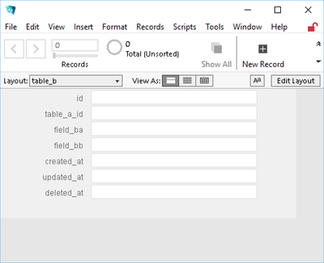
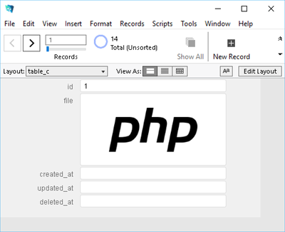
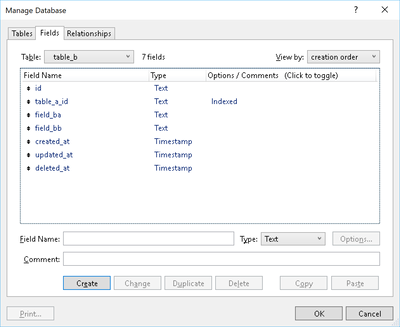
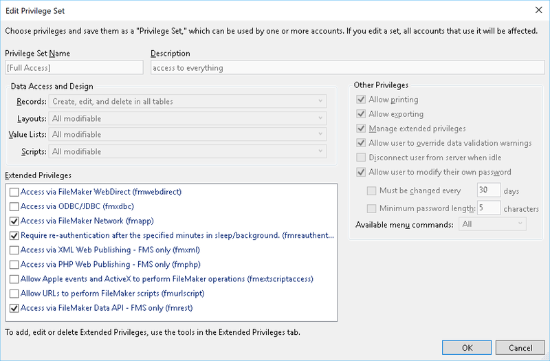
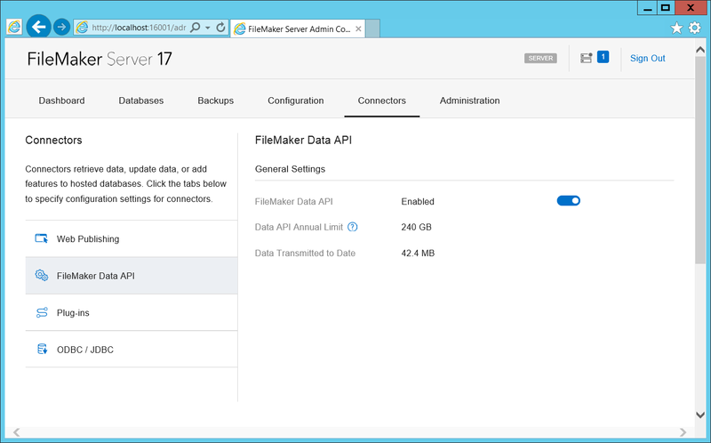

# FluentFM [](https://travis-ci.org/thyyppa/fluent-fm)

FluentFM is a PHP package that connects to FileMaker Server's Data API using a fluent query builder style interface.

### Requirements  

- PHP 7.2+  
- FileMaker Server 17  
  
### Installation  
  
#### Using Composer  
  
Use the command
  
```composer require thyyppa/fluent-fm```  
  
or include in your `composer.json` file  
```json  
{  
    "require": {  
        "thyyppa/fluent-fm": "dev-master"  
    }  
}  
```  

#### Prepare FileMaker

**Important! All tables and layouts *must* contain an `id` field.**

If you wish to use soft deletes your table and layout *must* contain the field `deleted_at`

The following fields are also recommended:
- `created_at` (for sorting by latest)
- `updated_at` (for sorting by last update)

All fields that you wish to access must be available in the layout that you provide while performing FileMaker operations through the api.

Ideally these will be hidden layouts that contain all fields raw, mirroring the table, but depending on your layout structure you may be able to use existing human-facing layouts. 

|  |  |
|:---:|:---:|
|  ||

Ensure that `fmrest` is enabled on your privilege set, which you can define in 

`File > Manage > Security > [highlight user] > Privilege Set [Edit]`



Also be sure that the Data API is enabled on the server.

If your server is installed locally this link should take you there:

[http://localhost:16001/admin-console/app/connectors/fmdapi](http://localhost:16001/admin-console/app/connectors/fmdapi)

Otherwise replace `localhost` with the server address.



---
  
### Usage

#### Getting records from layout

```php  
<?php  
  
use Hyyppa\FluentFM\Connection\FluentFMRepository;  
  
$fm = new FluentFMRepository([  
    'file' => 'FilemakerFilename',  
    'host' => '127.0.0.1',  
    'user' => 'Admin',  
    'pass' => 'secret',   
]);  
  
// get a single record as array
$record = $fm->record('layout', 'id')->get();

// get multiple records as array
$records = $fm->records('layout')->limit(10)->get();  
```

#### Performing a find operation

```php
$bobs = $fm->find('customers')->where('first','Bob')->get();
```

#### Creating a record

```php
$recordId = $fm->create('customers', [
    'id'    => 13
    'first' => 'Robert',
    'last'  => 'Paulson',
    'phone' => '406-555-0112',
]);
```

#### Updating a record

```php
// if multiple records are matched each will be updated
$fm->update('customers', [ 'phone' => '406-555-0199' ])
   ->where('id',13)
   ->limit(1)
   ->exec();
```

#### Deleting records

If you wish to use soft deletes your table and layout *must* contain the field `deleted_at`

```php
// hard delete removes record
$fm->delete('customers')
   ->where('id',13)
   ->limit(1)
   ->exec();

// soft delete sets record's deleted_at field
$fm->softDelete('customers')
   ->where('id',13)
   ->limit(1)
   ->exec();

// undeletes soft deleted records
$fm->undelete('customers')
   ->where('id',13)
   ->limit(1)
   ->exec();

// returns matching records that have not been soft deleted
$active = $fm
    ->find('customers')
    ->where('first','Bob')
    ->withoutDeleted()
    ->get();

// returns matching records even if soft deleted (default behavior)
$all = $fm
    ->find('customers')
    ->where('first','Bob')
    ->withDeleted()
    ->get();
```

#### Uploading and downloading files to a record's container

```php
// if query matches multiple, file will be added to each
$fm->upload('customers', 'photo', './path/to/photo.jpg')
   ->where('id', 13)
   ->limit(1)
   ->exec();

// if query matches multiple, all files will be downloaded to path
$fm->download('customers', 'photo', './save/to/path/')
   ->where('id', 13)
   ->limit(1)
   ->exec();
```

#### Running FileMaker scripts

```php
$fm->find('customers')
   ->where('id',13)
   ->script('scriptname', 'parameter')
   ->presort('presort_scriptname', 'presort_scriptparam')
   ->prerequest('prerequest_scriptname', 'prerequest_scriptparam')
   ->get()
```

---

#### Chainable commands

```php
...

->find( <layout> )
->update( <layout>, [fields], [recordId] )
->delete( <layout>, [recordId] )
->softDelete( <layout>, [recordId] )
->undelete( <layout>, [recordId] )
->upload( <layout>, <field>, <filename>, [recordId] )
->download( <layout>, <field>, [output_dir], [recordId] )
```

#### Chainable modifiers

```php
...

->record( <layout>, <id> )
->records( <layout>, [id] )
->limit( <limit> )
->offset( <offset> )
->sort( <field>, [ascending] )
->sortAsc( <field> )
->sortDesc( <field> )
->withPortals()
->withoutPortals()
->where( <field>, <params> )
->whereEmpty( <field> )
->has( <field> )
->whereNotEmpty( <field> )
->withDeleted()
->withoutDeleted()
->script( <script>, [param], [type] )
->prerequest( <script>, [param] )
->presort( <script>, [param] )
```

#### End of chain methods

```php
...

->get()
->exec()
->create( <layout>, [fields] )
->latest( <layout>, [field] )       # table must have created_at field if [field] undefined 
->oldest( <layout>, [field] )       # table must have created_at field if [field] undefined 
->lastUpdate( <layout>, [field] )   # table must have updated_at field if [field] undefined 
->first()
->last()
```

#### Misc commands
```php
...

// set global fields on table
->globals( [table], [ key => value ] )

// enable or disable automatic setting of id field (default enabled)
->enableAutoId()
->disableAutoId()

// clear query parameters
->clearQuery()

// clear query parameters and reset to default options
->reset()
```


### License

MIT License  
  
#### Disclaimer  

> This project is an independent entity and has not been authorized,
> sponsored, or otherwise affiliated with FileMaker, Inc.
> FileMaker is a trademark of FileMaker, Inc., registered in the U.S. and other
> countries.
