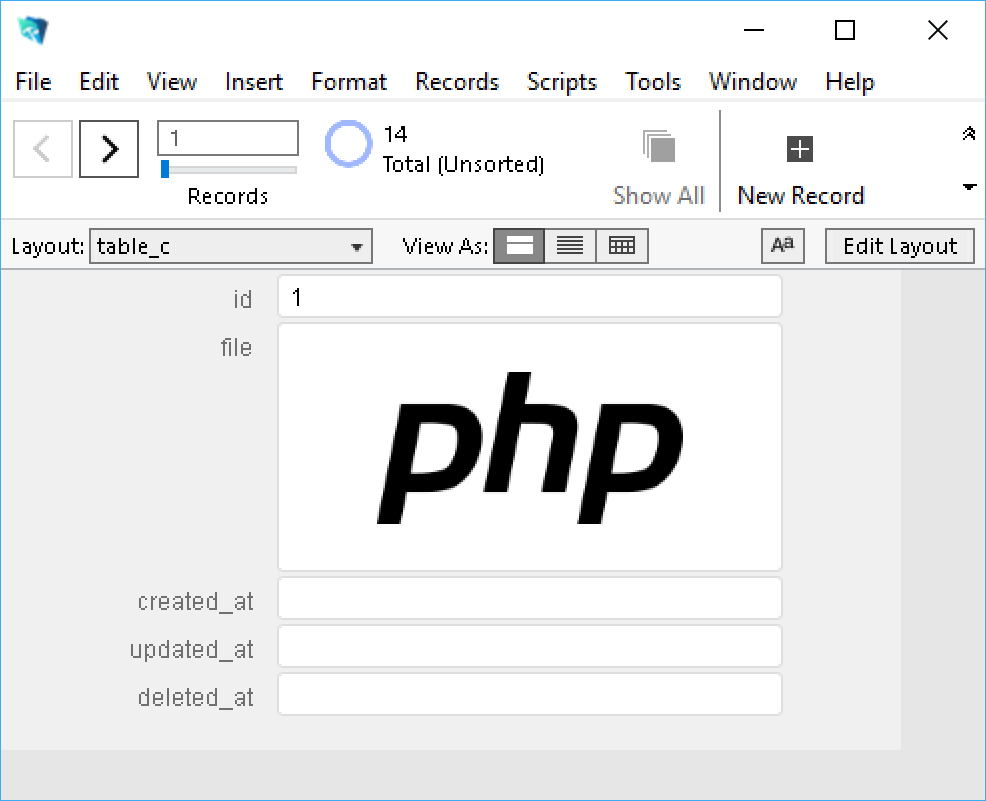

# FluentFM [](https://travis-ci.org/thyyppa/fluent-fm)

FluentFM is a PHP package that connects to FileMaker Server's Data API using a fluent query builder style interface.

### Requirements  

- PHP 7.1+  
- FileMaker Server 17  
  
### Installation  
  
#### Using Composer  
  
Use the command
  
```composer require thyyppa/fluent-fm```  
  
or include in your `composer.json` file  
```json  
{  
    "require": {  
        "thyyppa/fluent-fm": "dev-master"  
    }  
}  
```  

#### Prepare FileMaker

All records must contain the following fields:
- id
- created_at
- updated_at
- deleted_at

All fields that you wish to access must be available in the layout that you provide while performing FileMaker operations.

Ideally these will be hidden layouts that contain all fields raw mirroring the table, but depending on your layout structure you may be able to use existing human-facing layouts. 



---
  
### Usage

#### Getting records from layout

```php  
<?php  
  
use Hyyppa\FluentFM\Connection\FluentFMRepository;  
  
$fm = new FluentFMRepository([  
    'file' => 'FilemakerFilename',  
    'host' => '127.0.0.1',  
    'user' => 'Admin',  
    'pass' => 'secret',   
]);  
  
// get a single record
$record = $fm->record('layout', 'id')->get();

// get multiple records
$records = $fm->records('layout')->limit(10)->get();  

var_dump($record, $records);
```

#### Performing a find operation

```php
$bobs = $fm->find('customers')->where('first','Bob')->get();

var_dump($bobs);  
```

#### Creating a record

```php
$recordId = $fm->create('customers', [
    'id'    => 13
    'first' => 'Robert',
    'last'  => 'Paulson',
    'phone' => '406-555-0112',
]);
```

#### Updating a record

```php
$fm->update('customers', [ 'phone' => '406-555-0199' ])
   ->where('id',13)
   ->exec();
```

#### Deleting records

```php
// hard delete removes record
$fm->delete('customers')
   ->where('id',13)
   ->exec();

// soft delete sets record's deleted_at field
$fm->softDelete('customers')
   ->where('id',13)
   ->exec();

// undeletes soft deleted records
$fm->undelete('customers')
   ->where('id',13)
   ->exec();
```

#### Uploading and downloading files to a record's container

```php
$fm->upload('customers', 'photo', './path/to/photo.jpg')
   ->where('id', 13)
   ->exec();
   
$fm->download('customers', 'photo', './save/to/path/')
   ->where('id', 13)
   ->exec();
```

#### Running FileMaker scripts

```php
$fm->find('customers')
   ->where('id', 13)
   ->script('scriptname', 'parameter')
   ->presort('presort_scriptname', 'presort_scriptparam')
   ->prerequest('prerequest_scriptname', 'prerequest_scriptparam')
   ->get()
```

---

#### Chainable commands

```php
find( <layout> )
update( <layout>, [fields], [recordId] )
delete( <layout>, [recordId] )
softDelete( <layout>, [recordId] )
undelete( <layout>, [recordId] )
upload( <layout>, <field>, <filename>, [recordId] )
download( <layout>, <field>, [output_dir], [recordId] )
```

#### Chainable modifiers

```php
record( <layout>, <id> )
records( <layout>, [id] )
limit( <limit> )
offset( <offset> )
sort( <field>, [ascending] )
sortAsc( <field> )
sortDesc( <field> )
withPortals()
withoutPortals()
where( <field>, <params> )
whereEmpty( <field> )
has( <field> )
whereNotEmpty( <field> )
withDeleted()
script( <script>, [param], [type] )
prerequest( <script>, [param] )
presort( <script>, [param] )
```

#### End of chain methods

```php
get()
exec()
create( <layout>, [fields] )
latest( <layout>, [field] )
lastUpdate( <layout> )
oldest( <layout>, [field] )
first()
last()
```

#### Misc commands
```php
global( [table], [key=>value] )
```


### License

MIT License  
  
#### Disclaimer  

> This project is an independent entity and has not been authorized,
> sponsored, or otherwise affiliated with FileMaker, Inc.
> FileMaker is a trademark of FileMaker, Inc., registered in the U.S. and other
> countries.
